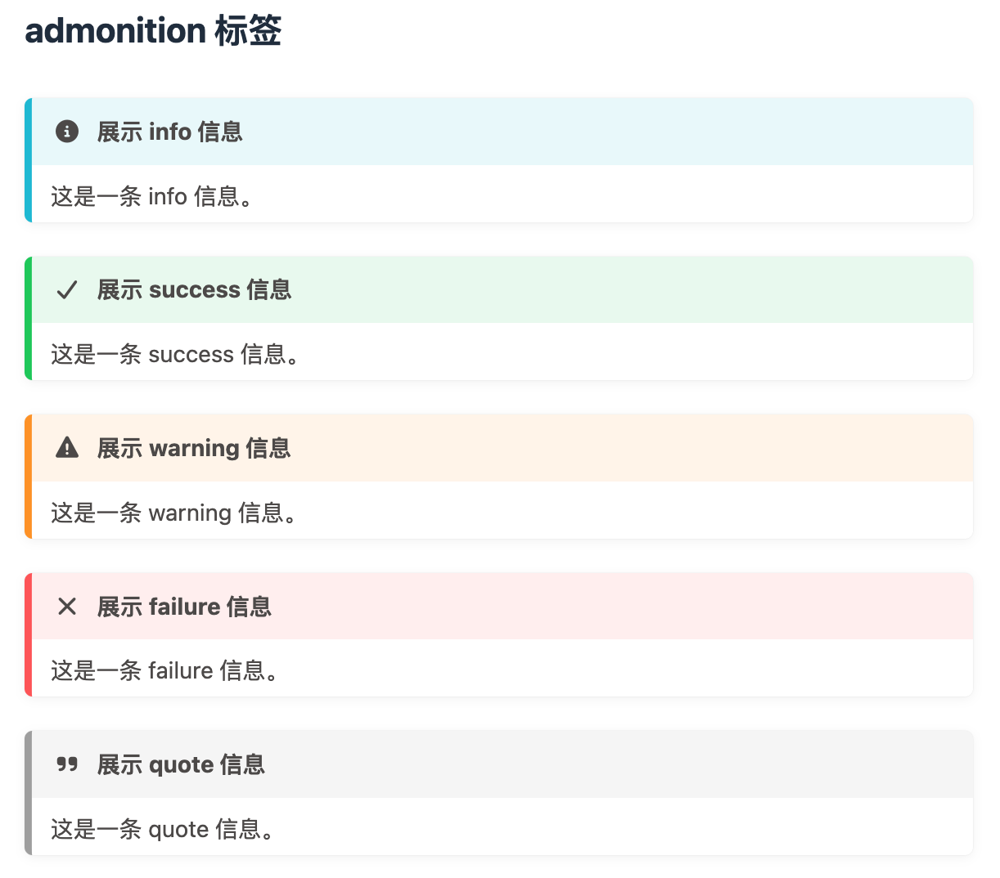
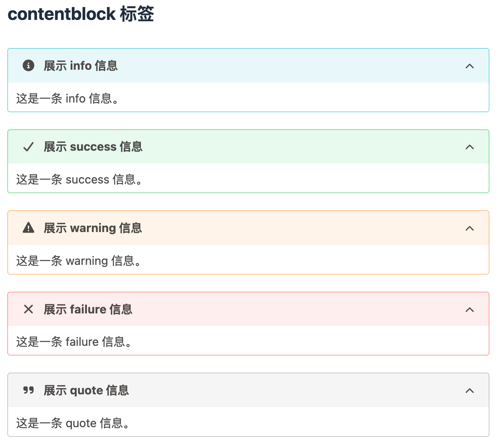
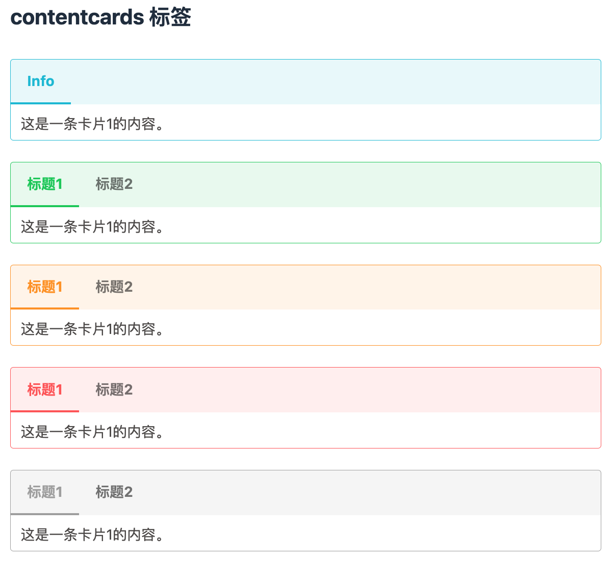
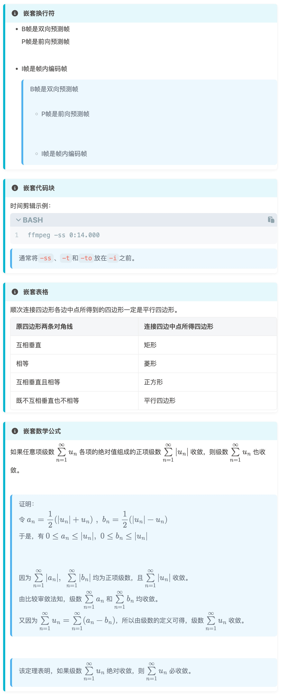

# hexo-content-plus 使用指南

## 简介
目前 `hexo-content-plus` 包括三种标签：
1. `admonition`：提示信息块。
2. `contentblock`：可折叠内容盒。
3. `contentcards`：卡片切换。

以上三种标签均有 `info`, `success`, `warning`, `failure`, `quote` 五种类型。

## 安装说明
```bash
npm install hexo-content-plus --save
```

## 语法说明
`hexo-content-plus` 和 hexo 标签的语法一致。例如:
```text

这是一条 info 信息。



这是一条 info 信息。



这是一条卡片1的内容。
<!--card-break-->
这是一条卡片2的内容。

```

> 标题 `title` 是可选的，当未设置时，将以 `type` 作为默认值：

## 支持类型
admonition 支持五种类型：
```text

这是一条 info 信息。



这是一条 success 信息。



这是一条 warning 信息。



这是一条 failure 信息。



这是一条 quote 信息。

```


contentblock 支持五种类型：
```text

这是一条 info 信息。



这是一条 success 信息。



这是一条 warning 信息。



这是一条 failure 信息。



这是一条 quote 信息。

```


contentcards 支持五种类型：
```text

这是一条卡片1的内容。
<!--card-break-->
这是一条卡片2的内容。



这是一条卡片1的内容。
<!--card-break-->
这是一条卡片2的内容。



这是一条卡片1的内容。
<!--card-break-->
这是一条卡片2的内容。



这是一条卡片1的内容。
<!--card-break-->
这是一条卡片2的内容。



这是一条卡片1的内容。
<!--card-break-->
这是一条卡片2的内容。

```


## 嵌套 markdown 标记
在 `hexo-content` 内部，还可以嵌套标准 Markdown 标签，例如：
```text

- B帧是双向预测帧
<br>
P帧是前向预测帧
<br><br>
- I帧是帧内编码帧
> B帧是双向预测帧
<br>
> - P帧是前向预测帧
<br><br>
> - I帧是帧内编码帧



时间剪辑示例：
```bash
ffmpeg -ss 0:14.000
```
> 通常将`-ss`、`-t`和`-to`放在`-i`之前。



顺次连接四边形各边中点所得到的四边形一定是平行四边形。
| 原四边形两条对角线 | 连接四边中点所得四边形 |
|:--------|:-------------|
| 互相垂直 | 矩形 |
| 相等 | 菱形 |
| 互相垂直且相等 | 正方形 |
| 既不互相垂直也不相等 | 平行四边形 |



如果任意项级数 $\sum\limits_{n=1}^{\infty} u_n$ 各项的绝对值组成的正项级数 $\sum\limits_{n=1}^{\infty} |u_n|$ 收敛，则级数 $\sum\limits_{n=1}^{\infty} u_n$ 也收敛。

> 证明：
令 $a_n = \dfrac{1}{2} (|u_n| + u_n)\ ,\ b_n = \dfrac{1}{2} (|u_n| - u_n)$
于是，有 $0 \leq a_n \leq |u_n|,\ 0 \leq b_n \leq |u_n|$
<br>
因为 $\sum\limits_{n=1}^{\infty} |a_n|,\ \sum\limits_{n=1}^{\infty} |b_n|$ 均为正项级数，且 $\sum\limits_{n=1}^{\infty} |u_n|$ 收敛。
由比较审敛法知，级数 $\sum\limits_{n=1}^{\infty} a_n$ 和 $\sum\limits_{n=1}^{\infty} b_n$ 均收敛。
又因为 $\sum\limits_{n=1}^{\infty} u_n = \sum\limits_{n=1}^{\infty} (a_n - b_n)$，所以由级数的定义可得，级数 $\sum\limits_{n=1}^{\infty} u_n$ 收敛。

> 该定理表明，如果级数 $\sum\limits_{n=1}^{\infty} u_n$ 绝对收敛，则 $\sum\limits_{n=1}^{\infty} u_n$ 必收敛。

```


## License
MIT
